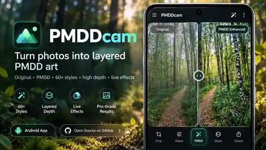
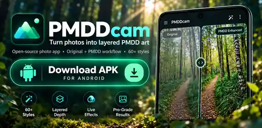
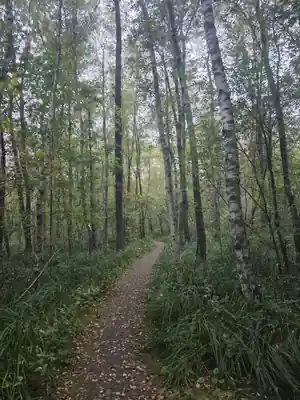
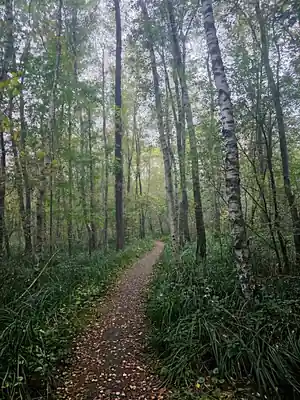
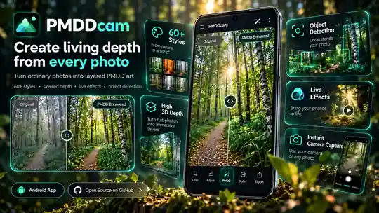
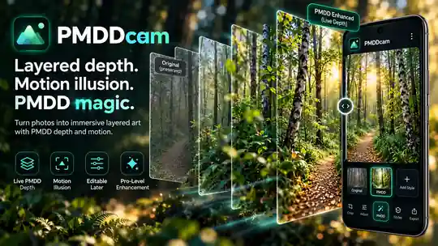
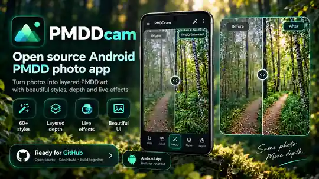

# PMDDcam

<div align="center">

**Perceptual Motion & Depth Design Camera for Android**

**Fotografiere einen tieferen Raum. · Photograph a deeper space.**

[](https://github.com/chekento/PMDDcam/actions/workflows/android.yml)


[](LICENSE)

<a href="https://raw.githubusercontent.com/chekento/PMDDcam/main/docs/assets/pmddcam-hero-01.webp">
  
</a>

### 🌐 Sprache / Language / Langue / Idioma / 语言 / 言語

**[Auto-detect Web Frontpage](https://raw.githack.com/chekento/PMDDcam/main/docs/index.html)** ·
[Deutsch](https://raw.githack.com/chekento/PMDDcam/main/docs/index.html?lang=de) ·
[English](https://raw.githack.com/chekento/PMDDcam/main/docs/index.html?lang=en) ·
[Français](https://raw.githack.com/chekento/PMDDcam/main/docs/index.html?lang=fr) ·
[Español](https://raw.githack.com/chekento/PMDDcam/main/docs/index.html?lang=es) ·
[中文](https://raw.githack.com/chekento/PMDDcam/main/docs/index.html?lang=zh) ·
[日本語](https://raw.githack.com/chekento/PMDDcam/main/docs/index.html?lang=ja)

</div>

---


## 🌐 Interaktive WebApp

<a href="https://raw.githack.com/chekento/PMDDcam/main/webapp/index.html"><strong>▶ PMDDcam Web direkt im Browser starten</strong></a>

Die Browser-Version liegt als eigenständiges Unterprojekt in [`webapp/`](webapp/) und bietet Bild-Upload, Kamera, Original ↔ PMDD, 80 Looks, 8–128 Tiefenebenen, statische Bewegungsillusion, interaktive 2.5D-Parallaxe, Touch/Maus, Geräteneigung, optionales Head-Tracking und lokalen PNG-Export — ohne Cloud-Upload oder API-Schlüssel.

## 📲 Android Preview herunterladen

<a href="https://github.com/chekento/PMDDcam/releases/download/v0.4.0/PMDDcam-0.4.0.apk">
  
</a>

<div align="center">

### [⬇ PMDDcam 0.4.0 · APK direkt herunterladen](https://github.com/chekento/PMDDcam/releases/download/v0.4.0/PMDDcam-0.4.0.apk)

Android 8.0+ · ARM64 / ARMv7 / x86_64 · Preview · ca. 229 MB  
**SHA-256:** [SHA256SUMS.txt](https://github.com/chekento/PMDDcam/releases/download/v0.4.0/SHA256SUMS.txt)

[Release & Prüfsumme](https://github.com/chekento/PMDDcam/releases/tag/v0.4.0) ·
[Builds](https://github.com/chekento/PMDDcam/actions) ·
[Changelog](CHANGELOG.md)

</div>

> Das Download-Banner lädt die APK direkt. Die übrigen Werbe- und Vergleichsbilder öffnen beim Anklicken die jeweilige Bilddatei in voller Größe.

---

## ✨ Original ↔ PMDD — dasselbe Foto, eine andere Tiefenwirkung

<table>
  <tr>
    <th align="center">ORIGINAL · BEFORE</th>
    <th align="center">PMDD · AFTER</th>
  </tr>
  <tr>
    <td align="center" width="50%">
      <a href="https://raw.githubusercontent.com/chekento/PMDDcam/main/docs/assets/pmddcam-before.webp">
        
      </a>
    </td>
    <td align="center" width="50%">
      <a href="https://raw.githubusercontent.com/chekento/PMDDcam/main/docs/assets/pmddcam-after.webp">
        
      </a>
    </td>
  </tr>
  <tr>
    <td align="center"><strong>Original bleibt unverändert erhalten.</strong></td>
    <td align="center"><strong>PMDD-Rezept bleibt nachträglich bearbeitbar.</strong></td>
  </tr>
</table>

PMDDcam arbeitet **nicht-destruktiv**: Das Original wird zuerst im privaten Projektspeicher gesichert. Tiefenkarte, Stil und PMDD-Rezept werden getrennt gehalten. Mit dem permanent sichtbaren **Original ↔ PMDD**-Schalter lässt sich die Wirkung jederzeit unmittelbar vergleichen.

---

## 🎨 PMDDcam in Bildern

<table>
  <tr>
    <td width="50%" align="center">
      <a href="https://raw.githubusercontent.com/chekento/PMDDcam/main/docs/assets/pmddcam-hero-02.webp">
        
      </a>
    </td>
    <td width="50%" align="center">
      <a href="https://raw.githubusercontent.com/chekento/PMDDcam/main/docs/assets/pmddcam-hero-03.webp">
        
      </a>
    </td>
  </tr>
  <tr>
    <td colspan="2" align="center">
      <a href="https://raw.githubusercontent.com/chekento/PMDDcam/main/docs/assets/pmddcam-hero-04.webp">
        
      </a>
    </td>
  </tr>
</table>

---

## Was PMDDcam macht

PMDDcam verbindet eine native Android-Kamera mit **PMDD 4.0 — Perceptual Motion & Depth Design**, lokaler Tiefenschätzung, Objekterkennung, 80 Stilrezepten und einer interaktiven 2.5D-Betrachtung. Fotoanalyse und Rendering laufen auf dem Gerät; die App benötigt für die Fotoverarbeitung **keinen Cloud-Upload und keinen API-Schlüssel**.

| Bereich | Enthalten |
|---|---|
| 📷 Kamera | Bildfüllendes CameraX, Front/Rückkamera, Tap-Fokus, Pinch-Zoom, Blitz, Raster, 3-/10-Sekunden-Timer; optionaler Auslöseton (Standard aus, Gerätevorgabe hat Vorrang) |
| ↔️ Sofortvergleich | Permanenter Original ↔ PMDD-Schalter auf dem Hauptschirm |
| 🧠 Lokale Analyse | MiDaS v2.1 Small, SSD-MobileNet und ML-Kit-Hilfen direkt auf dem Gerät |
| 🧊 Tiefe | 8–128 Viewer-Abtastebenen, Standard 96; Tiefenstärke bis 250 %, Trennung, Fokus, Relief, Atmosphäre, Bokeh |
| 🎯 Objektlogik | Anker / dynamisch / Atmosphäre; Bewegungsrichtung, Intensität, Tempo und Tiefenposition je Bereich |
| 🪄 Stile | 80 lokale Rezepte aus Foto, Illustration, Atelier, Retro, Zukunft und Atmosphäre |
| 👁 Betrachtermodus | Touch, Pinch, Geräteneigung oder optionale Kopfsteuerung; links/rechts, oben/unten, näher/weiter |
| 🧰 Bearbeitung | Kompakte Menüs für Looks / PMDD / Werkzeuge, Undo/Redo, Tiefenpinsel, manuelle Bereiche |
| 💾 Export | PNG, JPEG, Original, Tiefenkarte und vollständig bearbeitbares ZIP-Projekt |
| 🔒 Privatsphäre | Lokale Verarbeitung, keine Foto-Uploads, kein Cloudkonto, keine App-Internetberechtigung |

### Neu in 0.4.0

- **80 Looks mit erkennbaren Verfahren:** Comic-Konturen und Farbflächen, Aquarellpigment, Ölstruktur, Bleistiftschraffur, Neon-Kantenschein, Druckraster und feste Retro-Paletten.
- **Lebendige Objekte:** Im interaktiven Betrachter laufen begrenzte Objektbewegungen auch bei stillstehendem Blick. Unter **3D ansehen → Animation · Stärke und Tempo** lassen sie sich getrennt einstellen und ausschalten. Statische Anker bleiben ruhig; PNG/JPEG sind weiterhin unbewegte Fotos.
- **19 neue Looks**, darunter Linolschnitt, Pointillismus, Kreidepastell, Comic Noir, CGA 4, C64 16, CRT Arcade, Neon Wire und Thermal Vision (Falschfarben, keine Wärmekamera).
- Beschreibungen auf Look-Karten; volle Stilmischung bei Auswahl, danach frei regelbar.
- Stärkere statische Bewegungshinweise in zentralen Objektbereichen. Die Illusionswirkung hängt weiterhin von Motiv, Display und Betrachtung ab.
- Alle bisherigen Verbesserungen: PMDD Vivid, 96 Tiefenebenen, verbesserte kleine Objekte, Originalvergleich, kompakte Menüs und optionaler Systemauslöseton.

Für ein vorhandenes Projekt: **PMDD → Alle Einstellungen → PMDD Vivid · neue Standardabstimmung**. Für die neue automatische Objektzuordnung in alten Projekten: **Werkzeuge → Objekte → Objekte und Tiefe neu analysieren** (ersetzt manuelle Tiefen-/Objektänderungen nach Bestätigung). Nur den Look ändern: **Looks → Foto → PMDD Vivid**. Eigene Aufnahmevorgaben lassen sich im Kameramenü über **Aufnahme-Looks → PMDD-Vorgaben** umstellen.

PMDD Vivid orientiert sich an einem kräftigen, räumlichen Foto-Look. Es ist kein Aufruf von ChatGPT oder eines generativen Bilddienstes: Neue Blätter, Wolken, Lichtquellen oder verdeckte Objekte werden nicht erfunden. Für tatsächlich wechselnde Perspektiven **3D ansehen** verwenden; PNG/JPEG bleiben statische Fotos.

---

## Die 80 PMDD-fähigen Stile

<details>
<summary><strong>Alle Stilgruppen anzeigen</strong></summary>

| Gruppe | Stile |
|---|---|
| Foto | **PMDD Vivid (Standard)**, PMDD Natural, Cinematic, Soft Portrait, Alpine Clarity, Golden Hour, Blue Hour, Film Noir, Silver Gelatin, Matte Editorial, Chrome Color, Slide Film, Bleach Bypass, Dramatic B&W, Soft Bloom |
| Illustration | Comic Classic, Manga Ink, Anime Cel, Graphic Novel, Pop Art, Ligne Claire, Pastel Cel, Superhero, Storybook, Riso Comic, Comic Noir, Flat Cel, Poster Pop |
| Atelier | Wasserfarben, Aquarell Warm, Gouache, Ölgemälde, Impression, Tusche, Bleistift, Buntstift, Kohle, Kupferstich, Linolschnitt, Sumi-e, Kreidepastell, Dry Brush, Pointillismus |
| Retro | Retro 70s, Retro 80s, Instant Film, Sepia, Cyanotypie, VHS Print, 8-Bit Arcade, 16-Bit Adventure, Pocket Green, Newspaper, CGA 4, C64 16, CRT Arcade |
| Zukunft | Futuretech, Cyberpunk, Neon Tokyo, Holographic, Synthwave, Blueprint, Infrared Dream, Matrix Green, Deep Space, Liquid Metal, Thermal Vision, Neon Wire |
| Atmosphäre | Dream Pastel, Nordic Mist, Desert Sand, Emerald Forest, Sakura Bloom, Underwater, Lava Light, Arctic Ice, Moonlight, Velvet Dusk, Sunset Rose, Dream Bloom |

Die Stile verändern Pixel mit lokalen Bildverfahren, unter anderem Kantenzeichnung, Quantisierung, Pigment-/Papiertextur, Raster, Neon und Duoton. Sie erzeugen keine neuen semantischen Objekte wie ein generatives Bildmodell. Anschließend durchlaufen sie dieselbe PMDD-Verarbeitung.

</details>

---

## PMDD & interaktive Tiefe

**PMDD-Foto:** Ein statisches Einzelbild mit Tiefenstaffelung, lokaler Kontrastarchitektur, stabilen Ankern, atmosphärischer Trennung und objektgebundenen Bewegungshinweisen. Die wahrgenommene Wirkung hängt von Motiv, Display und Betrachtungsbedingungen ab.

**Interaktiver Viewer:** Eine zusätzliche 2.5D-Ansicht reagiert tatsächlich auf Touch, Geräteneigung und optional auf die relative Kopfposition vor der Frontkamera. Dynamische Bereiche erhalten zusätzlich eine begrenzte eigene Verschiebung; feste Flächen ändern nur ihre Perspektive. Das sind tiefengeführte Fotooberflächen, keine rekonstruierten vollständigen 3D-Objekte. Die Kopfsteuerung speichert keine Kameraaufnahme. Statische PNG/JPEG-Exporte enthalten diese Interaktion nicht.

Ein Einzelbild liefert keine metrisch vermessene 3D-Geometrie und keine echten verdeckten Rückseiten. MiDaS schätzt **relative** Tiefe. Das Objektmodell erkennt bewegungsfähige Klassen, aber keine reale Geschwindigkeit aus einem Foto: Auch ein geparktes Auto kann deshalb zunächst „dynamisch“ sein. Wolken und Dunst/Nebel werden konservativ aus Farbe, Bildstruktur und relativer Tiefe vorgeschlagen, nicht durch einen spezialisierten Wetterklassifikator sicher identifiziert. Rollen und Maskenbereiche lassen sich prüfen, deaktivieren oder manuell ergänzen.

Die 96 Standardebenen beschreiben die Viewer-Abtastung, nicht 96 automatisch freigestellte semantische Objekte.

---

## 🌍 Mehrsprachige Web-Frontpage

Die ergänzende Web-Frontpage und ihre Unterseiten erkennen die Browsersprache automatisch und unterstützen mindestens:

**Deutsch · English · Français · Español · 中文 · 日本語**

- [Übersicht / Overview — Auto-detect](https://raw.githack.com/chekento/PMDDcam/main/docs/index.html)
- [Funktionen / Features — Auto-detect](https://raw.githack.com/chekento/PMDDcam/main/docs/features.html)
- [Technik / Technology — Auto-detect](https://raw.githack.com/chekento/PMDDcam/main/docs/technology.html)

GitHub-README-Dateien führen aus Sicherheitsgründen kein JavaScript aus. Deshalb bietet die native Repository-Frontpage zusätzlich die sechs direkten Sprachlinks am Seitenanfang; die verlinkte Web-Frontpage übernimmt die automatische Spracherkennung.

---

## Vom Foto zum PMDD-Projekt

1. Foto aufnehmen oder ein vorhandenes Bild importieren.
2. Original unverändert im privaten Projektspeicher sichern.
3. Relative Tiefe lokal mit MiDaS schätzen; Objektbereiche mit SSD-MobileNet und ML Kit ergänzen.
4. PMDD standardmäßig mit PMDD Vivid, 96 Viewer-Ebenen und 125 % Tiefenstärke rendern.
5. Stil, Licht, Tiefe, Bewegungsidentitäten und lokale Bereiche nachträglich bearbeiten.
6. Statisches PNG/JPEG oder vollständiges Projekt mit Original, Tiefenkarte und Rezept exportieren.

Die Sammlung bleibt im privaten App-Speicher über Neustarts und kompatible Updates erhalten. Für ein externes Backup **„Bearbeitbares PMDD-Projekt“** exportieren. Eine Deinstallation entfernt den privaten App-Speicher.

---

## Technik, Build & Grenzen

<details>
<summary><strong>Technische Details anzeigen</strong></summary>

### Lokale Modelle

- **MiDaS v2.1 Small** für relative Tiefenschätzung aus einem Einzelbild
- **SSD-MobileNet** für bis zu 20 erkannte Bereiche aus 80 COCO-Klassen
- **ML Kit** für Gesichter und Personenmaske
- **ONNX Runtime** für lokale Inferenz

### Selbst bauen

Voraussetzungen: JDK 17, Android SDK 35, Build Tools 35.0.0.

```sh
bash scripts/fetch-model.sh
./gradlew testDebugUnitTest lintDebug assembleRelease
```

Die ONNX-Modelle werden beim Build aus ihren Veröffentlichungsquellen geladen und SHA-256-geprüft. Auf dem Smartphone laufen sie anschließend aus der APK.

### Preview-Signatur

Die Preview nutzt einen absichtlich öffentlichen Entwicklungsschlüssel in `signing/`, damit kompatible Preview-Updates installierbar bleiben. Für eine Produktion-/Play-Store-Veröffentlichung ist eine eigene Signatur erforderlich.

### Grenzen

Große virtuelle Blickwinkel können bei monokular geschätzter Tiefe Kanten dehnen. Export: bis 4096 Pixel längste Kante, bei kleinem App-Heap maximal 2048 Pixel. Reale Kameraqualität, Latenz und subjektive PMDD-Wirkung müssen zusätzlich auf physischen Geräten und mit unterschiedlichen Motiven geprüft werden.

</details>

[Technische Architektur](docs/ARCHITECTURE.md) · [Changelog](CHANGELOG.md) · [Third-party notices](app/src/main/assets/THIRD_PARTY.txt)

---

## PMDD-Herkunft

**PMDD — Perceptual Motion & Depth Design** ist das von **Kolja Werner Schumann (KoSch)** entwickelte Gestaltungsframework. Die Systematisierung entstand im Human-AI-Co-Design mit ChatGPT. PMDDcam überträgt seine Tiefen- und Bewegungsprinzipien auf eine lokale Android-Fotoverarbeitung und einen interaktiven Viewer.

[PMDD: Geschichte & Wahrnehmungsarchitektur](https://kosch.cloud/blog/pmdd---die-magie-hinter-der-illusion--wie-wahrnehmung-und-ki-zu-lebendigen-bildern-verschmelzen) · [kosch.cloud](https://kosch.cloud)

---

## 🔐 License & commercial use

Unless explicitly stated otherwise, the original software code authored for **PMDDcam** is licensed under the **PolyForm Noncommercial License 1.0.0**.

**SPDX identifier:** `PolyForm-Noncommercial-1.0.0`  
**Full license:** [LICENSE](LICENSE)

This license permits use, modification and redistribution for permitted **noncommercial** purposes. Commercial use is **not licensed** under these terms. This includes, in particular, incorporating the software into commercial products or services, selling it, paid redistribution, or monetizing derivatives without a separate written commercial license from the copyright holder.

**Commercial licensing & feedback:** Please contact **Kolja Werner Schumann** at [kolja.schumann+PMDDcam@gmail.com](mailto:kolja.schumann+PMDDcam@gmail.com) for feedback, permission requests and separate commercial licensing before any commercial use.

### Media, logos & promotional assets

Unless a specific file says otherwise, original PMDDcam logos, screenshots, marketing graphics and promotional artwork are licensed under **Creative Commons Attribution-NonCommercial-NoDerivatives 4.0 International (CC BY-NC-ND 4.0)**. Commercial use and distribution of modified versions are not permitted under that media license.

<https://creativecommons.org/licenses/by-nc-nd/4.0/>

### Third-party components

Third-party libraries, models, assets, trademarks and other third-party material remain subject to their own licenses and terms. The PolyForm license and the media license above do **not** relicense third-party material.

Copyright © 2026 **Kolja Werner Schumann**. See [NOTICE.md](NOTICE.md).
